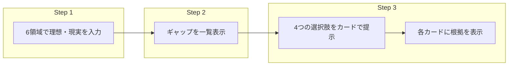

# 理想と現実のギャップ → 選択肢提示までの流れの見える化

> 相談者が「今どこにいるか」「次に何が見えるか」を迷わず理解できるように、一連の流れをわかりやすく提示する方法をまとめる。

---

## 1. 流れの全体像（3ステップ）

```
[Step 1] 現在地の整理（6領域）
    ↓ 理想と現実を入力
[Step 2] ギャップの見える化
    ↓ 「何が足りないか」がわかる
[Step 3] 選択肢の提示（4つの道＋根拠）
    ↓ 選んだ道で工程04へ
```

| ステップ | 相談者がすること | 画面で見える化するもの |
|----------|------------------|------------------------|
| **1. 現在地の整理** | 6領域それぞれで「理想」と「現実」を入力・選択する | 6領域のリスト、理想／現実の入力欄、進捗（何領域入力済みか） |
| **2. ギャップの見える化** | 自分が入力した理想と現実の差を**確認する** | 領域ごとの「理想 vs 現実」の比較、ギャップの大きさ（テキスト or ビジュアル） |
| **3. 選択肢の提示** | 4つの選択肢を**比較して選ぶ** | 4枚のカード（比較軸＋根拠）、選んだら次へ |

---

## 2. 見える化の方法（5つのアプローチ）

### 2-A. ステップインジケーター（進捗表示）

**目的**: 「今は流れのどこにいるか」を常に示す。

- 画面上部またはサイドに **Step 1 → 2 → 3** を表示。
- 現在のステップをハイライトし、完了したステップはチェックなどで表現。
- 文言例:
  - Step 1: 現在地を整理する
  - Step 2: 理想と現実のギャップを確認する
  - Step 3: 理想に近づく選択肢を見る

**効果**: 迷子にならない。あと何をすればいいかが一目でわかる。

---

### 2-B. 各ステップの「役割」を短い文で説明する（ナラティブ）

**目的**: 各画面に入ったときに「いま何をしている時間か」を一言で理解させる。

| ステップ | 画面に入ったときの説明文（例） |
|----------|------------------------------|
| Step 1 | 「6つの領域であなたの『理想』と『現実』を教えてください。あとでギャップを一緒に確認します。」 |
| Step 2 | 「理想と現実の差が一覧で見えています。『何を変えたいか』がはっきりすると、次の選択肢が選びやすくなります。」 |
| Step 3 | 「あなたのギャップに照らして、理想に近づく4つの選択肢を用意しました。それぞれの『選んだときの根拠』も書いてあるので、比べてみてください。」 |

- 各ステップの**冒頭**に上記のような1〜2文を表示する。
- 長くしない。スクロールしなくても読める長さがよい。

**効果**: 「なぜこれを入力するのか」「このあと何が起きるか」が伝わり、安心して進める。

---

### 2-C. ステップ間の「橋渡し」メッセージ

**目的**: Step 2 → Step 3 の切り替わりで、「ギャップ」と「選択肢」がつながっていることを明示する。

- **Step 2の最後**または**Step 3の冒頭**に、橋渡しの1文を入れる。
  - 例: 「あなたのギャップ（〇〇・△△）に合わせて、理想に近づく4つの選択肢を提示します。」
  - または: 「上のギャップを踏まえて、それぞれの選択肢で『何が変わりうるか』を根拠つきでまとめました。」

**効果**: 「いきなり選択肢が出てきた」ではなく、「自分の入力に基づいている」と感じられ、納得感が増す。

---

### 2-D. フロー図（説明・資料用）

**目的**: 社内資料・仕様書・プレゼンで「一連の流れ」を一覧できるようにする。



**縦書きフロー（テキスト）**

```
┌─────────────────────────────────────┐
│ Step 1  現在地の整理                  │
│ 6領域で「理想」と「現実」を入力        │
└──────────────┬──────────────────────┘
               ↓
┌─────────────────────────────────────┐
│ Step 2  ギャップの見える化            │
│ 理想と現実の差を一覧で確認            │
└──────────────┬──────────────────────┘
               ↓
┌─────────────────────────────────────┐
│ Step 3  選択肢の提示                  │
│ 4つの選択肢（根拠つき）を比較して選ぶ  │
└──────────────┬──────────────────────┘
               ↓
         工程04（判断軸の確立）へ
```

**効果**: 開発・運用・営業が同じ認識で「流れ」を話せる。

---

### 2-E. 一画面サマリー（要約ビュー）

**目的**: 一度に「全体の流れ」を見せたいとき（例: 初回説明、まとめ画面）に使う。

- **1枚の図 or 1画面**で、3ステップを並べて表示する。
  - 左: 「理想・現実を入力」→ 中: 「ギャップを確認」→ 右: 「4つの選択肢から選ぶ」
- 各ブロックにアイコン＋短いラベル（上記ナラティブの要約）を載せる。
- 「いまここ」を矢印やハイライトで示すとよりわかりやすい。

**効果**: 初めての人に「何をする流れか」を短時間で伝えられる。

---

## 3. 画面構成の推奨（実装の目安）

| 要素 | 推奨 |
|------|------|
| **全ステップ共通** | 画面上部にステップインジケーター（1→2→3）を表示。現在地をハイライト。 |
| **Step 1** | 6領域をカード or リストで表示。各領域に「理想」「現実」の入力欄。進捗（例: 3/6 領域入力済み）を表示。 |
| **Step 2** | 6領域ごとに「理想 vs 現実」を並べて表示。ギャップが大きい領域がひと目でわかるように（テキスト or バー・アイコン）。冒頭にナラティブ1文。 |
| **Step 2→3 のつなぎ** | 「あなたのギャップに合わせて、4つの選択肢を提示します」などの橋渡し1文。 |
| **Step 3** | 4枚の選択肢カードを並べて表示。各カードに比較軸＋「この選択肢を選んだときの根拠」。冒頭にナラティブ1文。選んだら「次へ」で工程04へ。 |

---

## 4. 相談者向けに「流れ」を伝える短い説明文（コピー案）

- **最初に一度だけ見せる用**:  
  「まず6つの領域であなたの理想と現実を教えてください。その差（ギャップ）を一緒に確認したあと、理想に近づく4つの選択肢を根拠つきでお渡しします。最後に、ご自身で納得して選べるまでサポートします。」

- **Step 3に入る直前**:  
  「理想と現実のギャップが確認できました。このギャップに合わせて、あなたに合う『4つの選択肢』と、それぞれを選んだときの根拠をまとめています。比べてみて、気になるものを選んでください。」

---

## 5. まとめ

| 見える化の方法 | 主な用途 |
|----------------|----------|
| **ステップインジケーター** | 画面UI（常時表示） |
| **ナラティブ（各ステップの説明文）** | 各画面の冒頭 |
| **橋渡しメッセージ** | Step 2→3 のつなぎ |
| **フロー図** | 仕様書・資料・プレゼン |
| **一画面サマリー** | 初回説明・まとめ |

この5つを組み合わせることで、「理想と現実のギャップを見える化 → 選択肢を提示する」一連の流れを、相談者にも社内にもわかりやすく提示できる。
